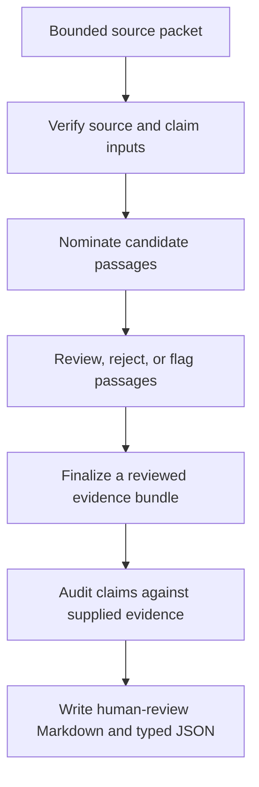

# Claim-support workflow

## The problem

AI-assisted research can produce a polished answer before anyone has checked whether its claims are supported by the evidence the workflow actually supplied.

I built this project family around a narrower question:

> Can the workflow preserve enough source, retrieval, review, and decision state for another person to inspect the path from source material to final claim?

The goal is not automated truth. The goal is a reviewable record.

## The operating model

Three public repositories carry different responsibilities.

| Component | Responsibility | Boundary |
| --- | --- | --- |
| [Evidence Bundler](https://github.com/camerontjs-dot/evidence-bundler) | Ingest bounded sources, nominate passages, preserve provenance, record review state, and write coverage reports | Retrieval scores are ranking signals, not support verdicts |
| [Apparatus Contracts](https://github.com/camerontjs-dot/apparatus-contracts) | Define versioned schemas, controlled vocabulary, hashes, and integrity checks for handoffs | Structural integrity does not establish methodological correctness |
| [Claim Audit Lab](https://github.com/camerontjs-dot/claim-audit-lab) | Apply deterministic checks to claims and supplied evidence, then produce reviewable reports | It audits support relative to supplied evidence, not truth in the world |

## Why I built it this way

My pharmaceutical background made the handoffs feel as important as the individual tools.

A result is difficult to defend when the source state has changed, the reviewer cannot see which version was used, or an intermediate decision disappears into a shared process. The software equivalent is the same. Preserve the original record. Separate retrieval from review. Keep the sealed input intact. Record deviations and limitations instead of smoothing them away.

That led to four design choices:

1. **Bounded inputs.** The tools work from an explicit source or evidence packet.
2. **Separate states.** Retrieval output, review annotations, refined excerpts, finalized bundles, and audit output remain distinguishable.
3. **Deterministic checks where possible.** Claim Audit Lab uses visible rules rather than a second model pretending to be an authority.
4. **Fail-visible boundaries.** Missing sources, unsupported claims, review gaps, and integrity failures appear in artifacts rather than disappearing behind a success message.

## What the public evidence shows

Evidence Bundler includes:

- Markdown, text, and PDF ingest;
- BM25 and hybrid retrieval;
- optional reranking and contradiction-candidate nomination;
- external review sidecars;
- reviewed-bundle finalization;
- coverage reporting;
- a pinned FDA CGMP guidance exercise that records both useful retrieval and false-positive spillover.

Claim Audit Lab includes:

- conservative claim extraction;
- deterministic evidence matching and rule checks;
- support, overstatement, source-gap, and risk labels;
- Markdown and JSON reports;
- fictional checked-in examples;
- validation-inspired requirements and IQ/OQ/PQ records for the published CLI boundary.

Apparatus Contracts includes:

- a versioned handoff specification;
- controlled vocabulary;
- hash and schema verification;
- negative tests for drift and malformed artifacts;
- an IQ/OQ/PQ-style qualification package for the verifier boundary.

## Current publication boundary

The public repositories prove the components and their design rules. They do not yet prove a fully published end-to-end product.

- Evidence Bundler and Apparatus Contracts are published.
- Claim Audit Lab's public release audits supplied YAML or JSON evidence.
- The Claim Audit Lab contract adapter and full synthetic round trip are in the local workbench and require a separate review, verification, and publication pass.
- The upstream Research Scaffold Harness is active local research work and is not a public repository.

I keep this distinction visible because "the pieces are designed to connect" is not the same claim as "the public release proves the complete integrated workflow."

## Where this transfers

The same design pattern applies outside research:

- controlled-document assistants;
- quality-event and CAPA evidence preparation;
- validation-package assembly;
- data-integrity review;
- regulated-software implementation;
- AI evaluation workflows where reviewers need source and decision traceability.

The useful skill is not a specific retrieval model. It is mapping the real process, deciding where human judgment belongs, preserving the evidence around that judgment, and making failure states inspectable.

## Known limits

- The tools do not replace source review or professional judgment.
- The FDA exercise measures retrieval behavior on one bounded corpus; it is not a general benchmark.
- The validation records demonstrate a validation-style approach. They do not make the tools GxP validated.
- The public Claim Audit Lab release and the current local apparatus workbench are not yet at the same integration state.
- No production customer deployment is claimed.

## Repositories

- [Evidence Bundler](https://github.com/camerontjs-dot/evidence-bundler)
- [Apparatus Contracts](https://github.com/camerontjs-dot/apparatus-contracts)
- [Claim Audit Lab](https://github.com/camerontjs-dot/claim-audit-lab)
