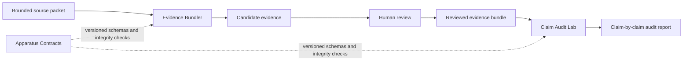

# Cameron Sanderson

Pharma QA/QC operator building inspectable AI workflows for regulated and evidence-heavy work.

I have more than eight years of experience across sterile compounding, analytical QC, OOS investigations, controlled records, safety programs, and direct communication with physicians and pharmacists. I now apply the same operating habits to software: preserve the source state, make review points visible, test the failure modes, and leave enough evidence for someone else to challenge the result.

Based in Ontario, Canada. Bilingual English and French.

## Start here

If you have one minute, these three repositories explain the direction:

1. [**Claim Audit Lab**](https://github.com/camerontjs-dot/claim-audit-lab) checks whether draft claims are supported by supplied evidence. It uses deterministic rules and produces reviewable Markdown and JSON reports with explicit limits.
2. [**Evidence Bundler**](https://github.com/camerontjs-dot/evidence-bundler) turns bounded source material into reviewable evidence bundles. Retrieval nominates candidate passages; human review decides what belongs in the final bundle.
3. [**Apparatus Contracts**](https://github.com/camerontjs-dot/apparatus-contracts) defines versioned handoffs, controlled vocabulary, and integrity checks for moving artifacts between tools without hiding the boundary.

Together, they show the pattern I am building toward: source material enters, provenance stays attached, review remains explicit, and final claims can be checked against the evidence the workflow actually supplied.

[Read the claim-support workflow case study.](CLAIM_SUPPORT_WORKFLOW.md)

## The workflow

The public tools are not a truth engine or a regulated quality system. Evidence Bundler nominates and packages evidence. Claim Audit Lab audits support relative to supplied evidence. Apparatus Contracts defines the intended handoff shape. The full contract adapter and upstream research harness remain active work rather than public-release claims.

## Other public work

[**Career Decision Engine**](https://github.com/camerontjs-dot/career-decision-engine) is a browser-based decision-support tool with visible scoring, separate rule checks, confidence labels, and validation sweeps. [Try the live demo.](https://camerontjs-dot.github.io/career-decision-engine/)

[**MindGraph**](https://github.com/camerontjs-dot/MindGraph) is a local retrieval engine over a Markdown knowledge workspace. It combines lexical and semantic retrieval, typed document links, bounded graph expansion, and an MCP interface.

[**Mainframe**](https://github.com/camerontjs-dot/MainFrame) is the Markdown-first knowledge and project workspace that MindGraph indexes. It separates inbox, ingest, durable knowledge, live state, projects, and archive by lifecycle.

[**Basic Research Harness**](https://github.com/camerontjs-dot/basic-research-harness) compares a raw Python agent loop with a project-configured SDK workflow so the procedure, review step, stop condition, and QA gate remain visible.

## What I am looking for

I am most useful where regulated operations meet implementation:

- regulated software implementation and customer technical services;
- quality systems, data integrity, and digital quality work;
- AI evaluation and evidence-handling workflows;
- forward-deployed or consulting work that requires mapping a real process before automating it.

My software work is self-taught and project-based. I am not presenting myself as a finished senior software engineer or ML researcher. The value I bring is the bridge between regulated operations, reviewable evidence, and working systems.

## Contact

- [LinkedIn](https://www.linkedin.com/in/cameron-sanderson/)
- [Email](mailto:camerontjs@gmail.com)
